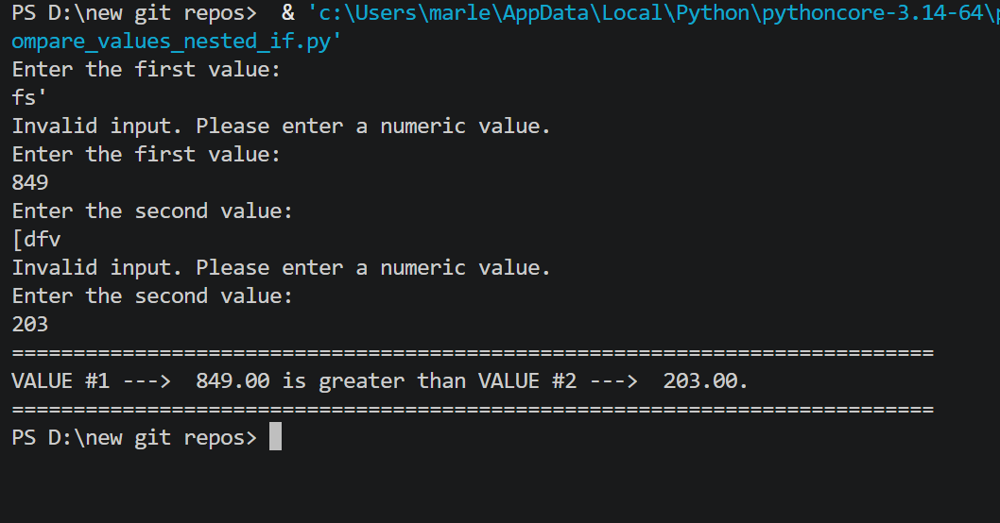

```markdown
# 🔀 Compare Two Values — Nested IF Statements

A Python console program that compares two user-entered numeric values using **nested IF statements** and reports whether they are equal, or which is greater.

---

## Features

- Accepts two numeric values as input (integers or decimals)
- Compares them using nested `if/else` logic
- Reports: equal, less than, or greater than
- Input validation — catches non-numeric entries and re-prompts

---

## How It Works

The program uses a **nested IF structure**:

```python
if value1 == value2:        # outer if — checks equality
    print("...are equal")
else:                       # outer else — values differ
    if value1 < value2:     # inner if — nested inside else
        print("...is less than")
    else:                   # inner else — only remaining case
        print("...is greater than")
```

This is different from Sequential IF — here Python enters the `else` branch *once* and only checks one inner condition.

---

## Example Output

```
Enter the first value:
45.50
Enter the second value:
100
===========================================================================
VALUE #1 --->  45.50 is less than VALUE #2 --->  100.00.
===========================================================================
```
---
## Screenshot



---

## Technologies Used

- Python 3
- `if / else / if / else` — nested conditional logic
- `format()` — formatted numeric output with commas and 2 decimal places
- `try/except` — input validation
- `while` loop — re-prompting on invalid input

---

## Nested IF vs Sequential IF

| Feature | Nested IF (this project) | Sequential IF |
|---|---|---|
| Structure | One if, one else containing another if/else | Three separate if statements |
| Efficiency | Stops checking after first true condition | Always evaluates all three conditions |

---

## Learning Outcomes

- Nested conditional logic (`if` inside `else`)
- Comparing numeric values
- Formatting numbers with commas and decimal places
- Input validation with `try/except`

---

## How to Run

1. Make sure Python 3 is installed: https://www.python.org/downloads/
2. Clone or download this repo
3. Open a terminal in the repo folder
4. Run: `python compare_values_nested_if.py`
5. Follow the prompts

---

## Folder Structure

```
compare-values-nested-if/
├── compare_values_nested_if.py
├── output.png
├── README.md
├── LICENSE
└── .gitignore
```

---

## License

This project is licensed under the MIT License — see the [LICENSE](LICENSE) file for details.

---

*Written by Marlena Fabrick — Computer Programming, Fall 2020*
```
